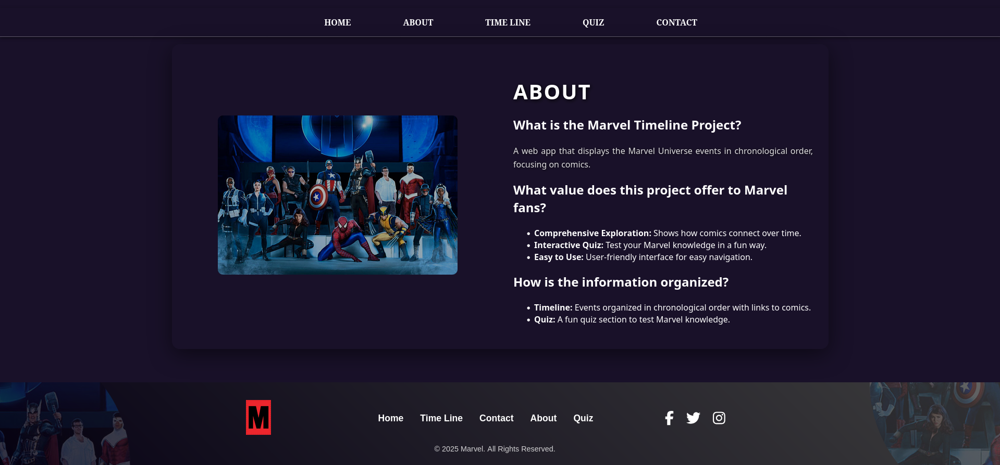
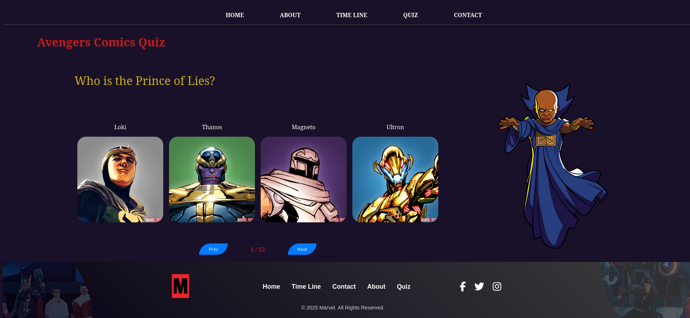
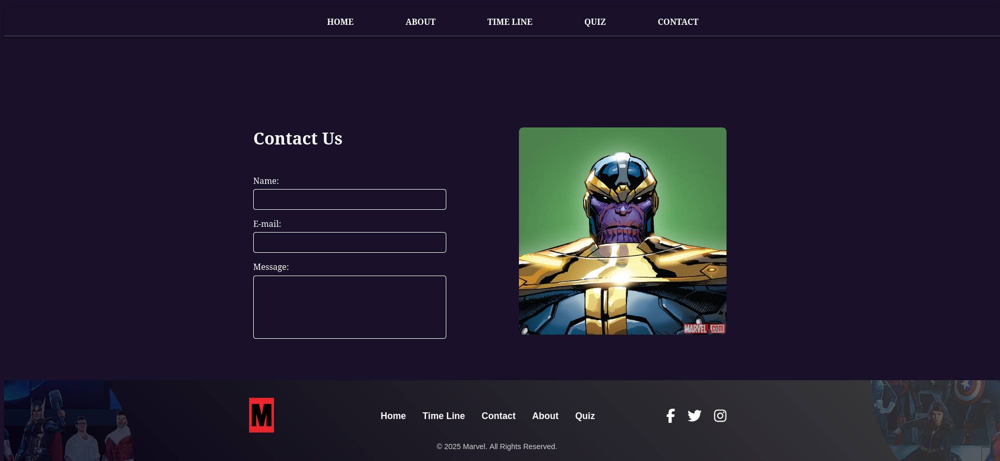

# marvel-timeline

This project is a Vue.js application that displays the Marvel timeline. It includes the following sections: Home, About, Timeline, Quiz, and Contact, footer.

## Características

Home: Main page.
About: About page with information about the application.
Timeline: Displays the chronology of Marvel events.
Quiz: An interactive section to test your Marvel knowledge.
Contact: A contact form for users.

## Imágenes de las Páginas

## Home Page

The **Home** page is the main screen of the application. Here, users can get an overview of the Marvel timeline and navigate to other sections.

  

### What does the Home page do?
- Displays an introduction to the Marvel timeline.  
- Contains navigation links or buttons to other sections of the app.  

## About Page

The **About** page provides an overview of the Marvel Timeline project, explaining its purpose and features.

  

### Overview  
This page explains the purpose of the **Marvel Timeline Project**, which organizes Marvel Universe events chronologically, focusing on comics.

### Key Features  
- Detailed timeline showcasing Marvel events.  
- Interactive quiz for testing Marvel knowledge.  
- Easy navigation with a user-friendly interface.  

## Timeline Page

The **Timeline** page displays Marvel Universe events in chronological order, with a focus on comics and key moments in Marvel history.

  <!-- Make sure the path is correct -->

### What does the Timeline page do?  
- Shows Marvel events in a chronological timeline format.  
- Provides links to related comics for each event.  
- Allows users to explore key moments in the Marvel Universe in an interactive way.

### Features  

- **Chronological Order:** Events are displayed in the order they occurred in the Marvel Universe.  
- **Comic Links:** Each event has links to related Marvel comics for further exploration.  
- **Interactive:** Users can click on events for more details about each milestone.


## Quiz Page

The **Quiz** page is an interactive section where users can test their Marvel knowledge with fun and engaging questions.

  <!-- Make sure the path is correct -->

### What does the Quiz page do?  
- Provides a set of questions related to Marvel events and characters.  
- Users can select answers and see their results after completing the quiz.  
- A fun and engaging way to challenge Marvel fans.

### Features  
- **Marvel Trivia:** Questions related to the Marvel Universe.  
- **Interactive:** Users select answers and get immediate feedback.  
- **Fun Challenge:** Test your knowledge about Marvel comics, characters, and events.

## Contact Page

The **Contact** page allows users to reach out with inquiries, feedback, or suggestions related to the Marvel Timeline app.

  <!-- Make sure the path is correct -->

### What does the Contact page do?  
- Provides a form where users can enter their name, email, and message.  
- Allows users to send feedback or ask questions about the Marvel Timeline project.  

### Features  
- **Contact Form:** Users can enter their details and send a message.  
- **Fields:** Name, email, and message fields for easy communication.  

## Project setup
```
npm install
```

### Compiles and hot-reloads for development
```
npm run serve
```

### Compiles and minifies for production
```
npm run build
```

### Lints and fixes files
```
npm run lint
```

### Customize configuration
See [Configuration Reference](https://cli.vuejs.org/config/).
