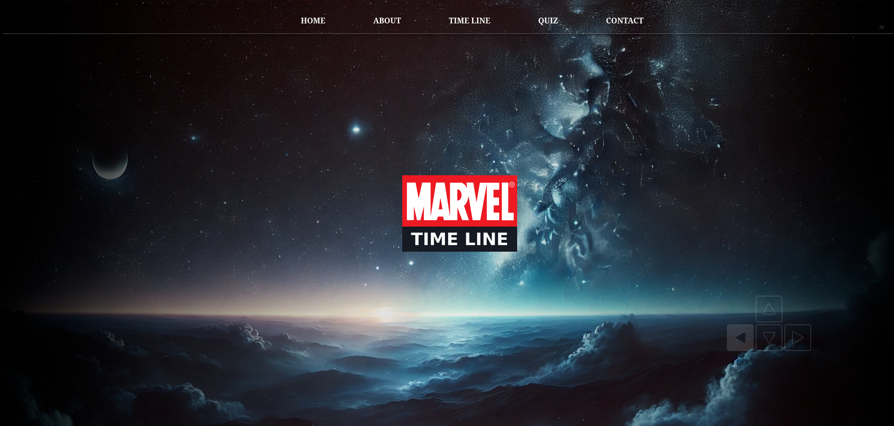

# marvel-timeline

This project is a Vue.js application that displays the Marvel timeline. It includes the following sections: Home, About, Timeline, Quiz, and Contact, footer.

## Características

Home: Main page.
About: About page with information about the application.
Timeline: Displays the chronology of Marvel events.
Quiz: An interactive section to test your Marvel knowledge.
Contact: A contact form for users.

## Imágenes de las Páginas

## Home Page

The **Home** page is the main screen of the application. Here, users can get an overview of the Marvel timeline and navigate to other sections.

  <!-- Make sure to update the path to the correct image -->

### What does the Home page do?
- Displays an introduction to the Marvel timeline.  
- Contains navigation links or buttons to other sections of the app.  
- May include images, banners, or a brief description of Marvel’s chronology.

## Project setup
```
npm install
```

### Compiles and hot-reloads for development
```
npm run serve
```

### Compiles and minifies for production
```
npm run build
```

### Lints and fixes files
```
npm run lint
```

### Customize configuration
See [Configuration Reference](https://cli.vuejs.org/config/).
