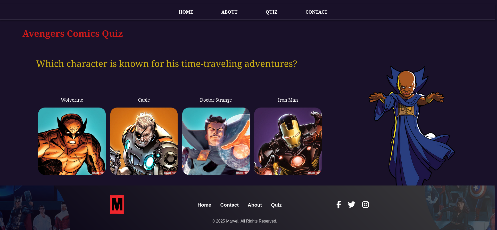

# marvel-timeline

This project is a Vue.js application that displays the Marvel timeline. It includes the following sections: Home, About, Timeline, Quiz, and Contact, footer.

## Características

- Home: Main page.
- About: About page with information about the application.
- Timeline: Displays the chronology of Marvel events.
- Quiz: An interactive section to test your Marvel knowledge.
- Contact: A contact form for users.

## Imágenes de las Páginas

# Marvel timeline Logo 

"The Marvel Logo is displayed on the Home page to reinforce the theme of the Marvel Universe in the application."


### Details:
- **File Name**: `src/assets/img/logoTimeline.png`
- **Location**: `src/assets/img/`
- **Purpose**: It is used on the Home page as part of the app's branding.

This logo represents the Marvel brand and helps establish the theme of the Marvel Universe in the application.

# Marvel Logo in Footer  

The footer includes the Marvel logo to enhance the app’s visual identity and maintain a consistent brand look.  


## Implementation  
1. The Marvel logo is displayed in the footer.  
2. The logo is responsive and adjusts to different screen sizes.


## Navbar
The **Navbar** is a fixed navigation bar at the top of the page that provides links to the main sections of the application: Home, About, Quiz, and Contact.

  

### Features
- **Responsive Navigation:** The navbar stays fixed at the top of the page, allowing easy access to the navigation links.
- **Navigation Links:** Each link directs the user to a different section of the app (Home, About, Quiz, Contact).
- **Interactive Hover Effect:** Links change color on hover, providing a visual cue to users.

### What does the Navbar do?
- Provides links to navigate between pages in the Marvel Timeline application.
- Keeps the navigation bar accessible while scrolling through the app.
## Home Page

The **Home** page is the main screen of the application. Here, users can get an overview of the Marvel timeline and navigate to other sections.

  

### What does the Home page do?
- Displays an introduction to the Marvel timeline.  

## About Page

The **About** page provides an overview of the Marvel Timeline project, explaining its purpose and features.

  

### Overview  
This page explains the purpose of the **Marvel Timeline Project**, which organizes Marvel Universe events chronologically, focusing on comics.

### Key Features  
- Detailed timeline showcasing Marvel events.  
- Interactive quiz for testing Marvel knowledge.  
- Easy navigation with a user-friendly interface.  

## Timeline Page

The **Timeline** page displays Marvel Universe events in chronological order, with a focus on comics and key moments in Marvel history.


### What does the Timeline page do?  
- Shows Marvel events in a chronological timeline format.  
- Provides links to related comics for each event.  
- Allows users to explore key moments in the Marvel Universe in an interactive way.

## Interactive Comic

This feature allows users to click on a comic to view detailed information about it. Upon clicking, a pop-up section opens with the details of the selected comic. 


## How It Works

- A list of comics is displayed in the application.
- When a user clicks on a comic, an event triggers that displays the corresponding information.

### Features  

- **Chronological Order:** Events are displayed in the order they occurred in the Marvel Universe.  
- **Comic Links:** Each event has links to related Marvel comics for further exploration.  
- **Interactive:** Users can click on events for more details about each milestone.


## Quiz Page

The **Quiz** page is an interactive section where users can test their Marvel knowledge with fun and engaging questions.

  

### What does the Quiz page do?  
- Provides a set of questions related to Marvel events and characters.  
- A fun and engaging way to challenge Marvel fans.

### Features  
- **Marvel Trivia:** Questions related to the Marvel Universe.  
- **Fun Challenge:** Test your knowledge about Marvel comics, characters, and events.

## Contact Page

The **Contact** page allows users to reach out with inquiries, feedback, or suggestions related to the Marvel Timeline app.

  

### What does the Contact page do?  
- Provides a form where users can enter their name, email, and message.  
- Allows users to send feedback or ask questions about the Marvel Timeline project.  

### Features  
- **Contact Form:** Users can enter their details and send a message.  
- **Fields:** Name, email, and message fields for easy communication.  

## Footer Component

The **Footer** component provides important information at the bottom of the page, including navigation links, social media icons, and copyright information. It is designed to appear only when the user scrolls near the bottom of the page unless on static pages like **About**, **Contact**, or **Quiz**.


### Features
- **Responsive Design:** The footer adapts for different screen sizes with a grid layout for larger screens and a single column for mobile devices.
- **Hover Effects:** Links and social media icons feature hover effects that enhance interactivity.
- **Social Media Links:** Provides quick access to Marvel's social media pages, including Facebook, Twitter, and Instagram.

### What does the Footer do?
- Displays a logo, navigation links, social media icons, and copyright information.
- Adjusts its visibility based on user interaction (scrolling).


## 👥 DEVELOPER TEAM - AVENGERS  

- **Product Owner:** Carla Siles Calizaya - [GitHub](https://github.com/carlasiles1)
- **Scrum Master:** Alejandro Serrato - [GitHub](https://github.com/Varushet)
- **First Programmer:** luChamorro - [GitHub](https://github.com/luchamorro)
- **Second Programmer:** Najwa El Qortobi - [GitHub](https://github.com/Najwaelqortobi)
- **Third Programmer:** Aleeza Sajid - [GitHub](https://github.com/Aleeza951)

## Project setup
```
npm install
```

### Compiles and hot-reloads for development
```
npm run serve
```

### Compiles and minifies for production
```
npm run build
```

### Lints and fixes files
```
npm run lint
```

### Customize configuration
See [Configuration Reference](https://cli.vuejs.org/config/).
